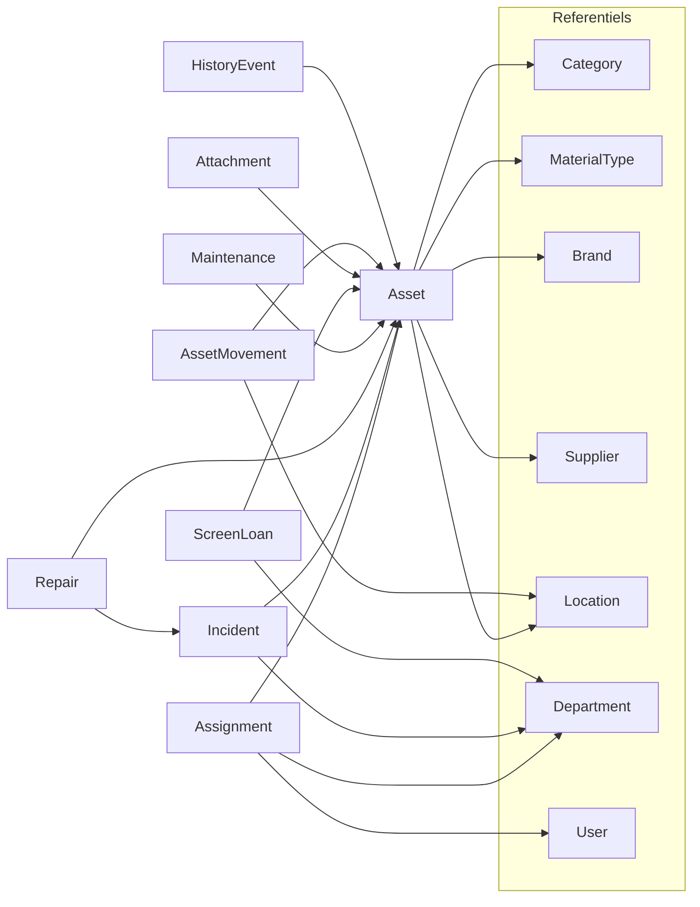

# Migration schéma Prisma + modules API

## Décisions figées

- **Données** : reset dev (`prisma migrate reset`) + seeds adaptés — pas de backfill.
- **Périmètre** : CRUD complets pour Category, Brand, Location, Department, Maintenance, Attachment, AssetMovement + mise à jour de tous les modules existants.
- **Soft-delete** homogène sur les référentiels uniquement : `Department`, `Supplier`, `MaterialType`, `Category`, `Brand`, `Location` (`deletedAt`). Les entités transactionnelles (`Asset`, `Assignment`, etc.) restent en hard delete.
- **Affectation** : `Assignment.user` Json → `userId` → `User` ; `department` string → `departmentId`.

## Corrections au schéma cible

Fichier : [`it-stock-api/prisma/schema.prisma`](it-stock-api/prisma/schema.prisma)

Appliquer le schéma fourni avec ces correctifs :

1. **`Location` ↔ `AssetMovement`** — ajouter les relations inverses :

```prisma
model Location {
  // ...
  assets Asset[]
  movementsFrom AssetMovement[] @relation("FromLocation")
  movementsTo   AssetMovement[] @relation("ToLocation")
}
```

2. **Soft-delete référentiels** — `deletedAt DateTime?` sur `Supplier`, `MaterialType`, `Category`, `Brand`, `Location` (en plus de `Department`).

3. **`Supplier`** — conserver `email`/`phone` du schéma cible ; retirer l’ancien soft-delete orphelin sans relation Asset (déjà corrigé via `supplierId`).

4. Migration : une nouvelle migration Prisma après remplacement du schéma, puis `prisma migrate reset` + regenerate client.



## Phase 1 — Schéma + seeds

- Remplacer [`schema.prisma`](it-stock-api/prisma/schema.prisma).
- Générer migration + `migrate reset`.
- Réécrire seeds :
  - [`prisma/seed.ts`](it-stock-api/prisma/seed.ts) : `firstName`/`lastName` au lieu de `name`
  - [`prisma/seed-assets.ts`](it-stock-api/prisma/seed-assets.ts) : créer Category/Brand/MaterialType/Supplier/Location puis assets avec FKs + `serialNumber`
  - [`prisma/seed-assignments.ts`](it-stock-api/prisma/seed-assignments.ts) : `userId` + `departmentId`
  - Adapter `seed-suppliers` / `seed-material-types` ; ajouter seeds minimaux departments/categories/brands/locations si besoin

## Phase 2 — Nouveaux modules CRUD

Pattern existant (controller / service / dto / module), montés dans [`app.ts`](it-stock-api/src/app.ts) derrière `authenticate` :

| Module | Préfixe | Soft-delete |
|--------|---------|-------------|
| `departments` | `/api/departments` | oui |
| `categories` | `/api/categories` | oui |
| `brands` | `/api/brands` | oui |
| `locations` | `/api/locations` | oui |
| `maintenances` | `/api/maintenances` | non |
| `attachments` | `/api/attachments` | non |
| `movements` | `/api/movements` | non |

Comportement soft-delete (aligné sur intention schéma) : `DELETE` → `update({ deletedAt: now() })` ; listes filtrées `deletedAt: null` ; enrichir aussi [`suppliers`](it-stock-api/src/modules/suppliers) et [`material-types`](it-stock-api/src/modules/material-types) (aujourd’hui hard delete).

Endpoints métier clés :
- **Maintenances** : CRUD + changement de statut (`PLANIFIEE` → `EN_COURS` → `TERMINEE` / `ANNULEE`) + `HistoryEvent` `MAINTENANCE_CREATED`
- **Attachments** : create/list/delete liés à un asset (stockage fichier simple : `filePath` fourni ou upload local minimal cohérent avec le reste de l’API)
- **Movements** : create (met à jour `asset.locationId` si `toLocationId`) + history `LOCATION_CHANGED`

## Phase 3 — Mise à jour modules existants

### Auth — [`src/modules/auth`](it-stock-api/src/modules/auth)
- Register/login DTO + service : `name` → `firstName` + `lastName`
- JWT/payload si `name` exposé → adapter

### Stocks — [`src/modules/stocks`](it-stock-api/src/modules/stocks)
- DTOs : `type`/`brand`/`supplier` strings → `categoryId`, `materialTypeId`, `brandId`, `supplierId?`, `locationId?`, `purchasePrice?`, `serialNumber`
- Service : `include` des relations ; recherche sur relations (`materialType.name`, `brand.name`, etc.)
- Filtres : `department` via `assignments.departmentId` / relation Department

### Assignments — [`src/modules/assignments`](it-stock-api/src/modules/assignments)
- Create DTO : `userId`, `departmentId`, `note?`
- Remplacer tous les `user` Json / `department` string
- History payloads : IDs + noms résolus

### Incidents — [`src/modules/incidents`](it-stock-api/src/modules/incidents)
- `departmentId` à la place de `department` string

### Workshop (Repair) — [`src/modules/workshop`](it-stock-api/src/modules/workshop)
- `Repair` lié à `assetId` (+ `incidentId` optionnel)
- Adapter start-repair : résoudre l’asset depuis l’incident ou accepter `assetId` direct
- Selects asset : relations au lieu de `type`/`brand` plats

### Screen loans — [`src/modules/screen-loans`](it-stock-api/src/modules/screen-loans)
- `borrowerDepartment` → `departmentId?`

### Dashboard — [`src/modules/dashboard`](it-stock-api/src/modules/dashboard)
- Mettre à jour `$queryRaw` / groupBy si colonnes renommées (`serialNumber`, etc.)

### PDF / Impression — [`src/modules/pdf`](it-stock-api/src/modules/pdf) + [`impression`](it-stock-api/src/modules/impression)
- Mapper depuis relations : `asset.brand.name`, `asset.materialType.name`, `assignment.user.firstName`, `department.name`
- Types PDF (`serial_number` → `serialNumber` ou mapping explicite)

### Swagger — [`src/config/swagger.ts`](it-stock-api/src/config/swagger.ts)
- Documenter nouveaux endpoints et nouveaux champs DTO

## Phase 4 — Vérification

- `npx prisma validate` + `prisma generate`
- Compile TypeScript (`tsc` / build existant)
- Smoke test manuel des routes critiques : create asset (FKs), assignment, incident→repair, screen-loan, movement, maintenance

## Hors périmètre

- Front [`it-stock-control`](it-stock-control) : sera cassé par les nouveaux contrats API (`supplierId`, `userId`, etc.) — non modifié dans ce plan ; à traiter ensuite.
